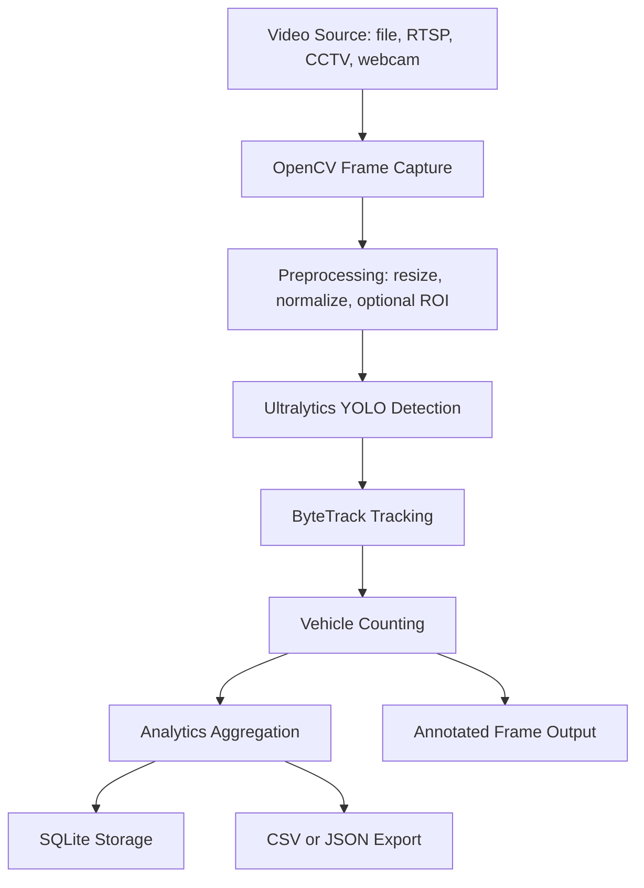
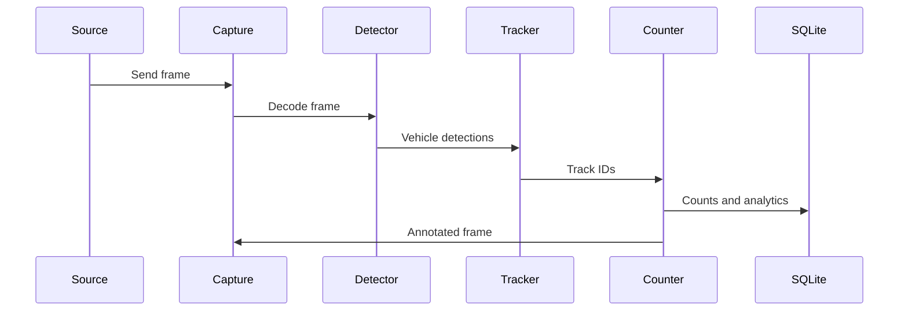

# Context: Python AI Traffic Analysis System

## 1. Project Overview

This project is a Python-only real-time traffic analysis system that uses pretrained computer vision models and existing libraries. The goal is to detect vehicles in video streams, track them across frames, count them, classify basic vehicle types, and store results for later review.

Supported inputs:
- Video file path
- CCTV footage
- RTSP stream
- Webcam feed

Core outputs:
- Bounding boxes around vehicles
- Persistent track IDs
- Vehicle counts by class and direction
- Simple analytics such as hourly counts, peak traffic windows, and per-camera summaries
- Annotated output video or frame stream

Why pretrained models only:
- Faster to ship
- No dataset collection
- No training pipeline
- Lower maintenance cost
- Easier to deploy on CPU or GPU

Expected performance:
- Near real-time on a GPU with lightweight YOLO models
- Lower FPS on CPU, but still usable for offline or moderate-speed live analysis
- Best results with 720p input and a lightweight model such as YOLOv8n or YOLOv8s

Best use cases:
- Parking and road traffic monitoring
- Gate entry counting
- Junction vehicle flow analysis
- CCTV-based vehicle analytics
- Security and operational monitoring

## 2. Best Pretrained Libraries And Models

The simplest and fastest stack is:
- OpenCV for video capture and frame handling
- Ultralytics YOLO for detection
- ByteTrack for tracking
- Supervision for annotation, zones, counting, and visualization helpers

### Recommendation Summary

Best default choice:
- YOLOv8 + Ultralytics + ByteTrack + Supervision

Why this is the best fit:
- Very fast to implement
- Mature and widely used
- Minimal setup
- Good real-time performance
- Clean Python API

### Ultralytics Package

Install:
```bash
pip install ultralytics
```

Why use it:
- Single package for pretrained YOLO models
- Simple inference API
- Easy export and deployment options
- Native tracking support

Tradeoff:
- It hides some lower-level control, but that is a good tradeoff for fast development.

CPU vs GPU:
- Works on both
- GPU is strongly preferred for live streams
- CPU is acceptable for low-FPS or offline processing

### YOLOv8

Install:
```bash
pip install ultralytics
```

Why use it:
- Stable and proven
- Best balance of speed, simplicity, and documentation
- Strong production track record

Tradeoff:
- Slightly older than YOLOv11, but more predictable for rapid shipping

Recommendation:
- Use YOLOv8n for maximum speed
- Use YOLOv8s if you want a bit more detection quality

### YOLOv11

Install:
```bash
pip install ultralytics
```

Why use it:
- Newer model family
- Can improve accuracy in some cases

Tradeoff:
- Less proven than YOLOv8 for quick production work
- Not the default choice if speed and simplicity matter most

Recommendation:
- Treat YOLOv11 as optional evaluation only

### Supervision Library

Install:
```bash
pip install supervision
```

Why use it:
- Makes bounding box drawing, track visualization, zones, and counting much easier
- Very useful for traffic analytics pipelines
- Keeps post-processing clean and readable

Tradeoff:
- Adds another dependency, but it saves time and code complexity

CPU vs GPU:
- Works with both because it is mainly post-processing

### ByteTrack

Install:
```bash
pip install ultralytics supervision
```

Why use it:
- Fast tracking
- Lightweight
- Works well with YOLO detections
- Good fit for vehicle tracking in traffic scenes

Note:
- ByteTrack is usually enabled through Ultralytics tracker configuration or a Supervision-based tracking workflow, so there is no separate heavy setup step.

Tradeoff:
- Can have ID switches in dense scenes, but it is still the best fast default choice

CPU vs GPU:
- Runs efficiently on CPU
- Pairs well with GPU inference

### DeepSORT

Install:
```bash
pip install deep-sort-realtime
```

Why use it:
- Can improve identity stability in crowded scenes

Tradeoff:
- Slower and heavier than ByteTrack
- More tuning
- Not the first choice for fast implementation

Recommendation:
- Use only if ByteTrack is not stable enough for a specific camera scene

### Practical Choice Order

1. YOLOv8n or YOLOv8s
2. ByteTrack
3. Supervision
4. OpenCV
5. SQLite

## 3. Complete System Architecture

The system should be simple and sequential:

1. Ingest video frames
2. Run vehicle detection
3. Track detected vehicles
4. Count vehicles by class and direction
5. Store analytics in SQLite
6. Save annotated video or images

### Recommended Flow



### Frame Processing Flow



### Processing Notes

- Keep the pipeline single-purpose and easy to debug
- Use a frame queue if input is unstable
- Use a fixed ROI if the camera view is known
- Skip frames only if you need more speed on CPU
- Prefer GPU acceleration when available

## 4. Recommended Final Stack

Use this stack for the fastest and most efficient implementation:

- Python 3.11+
- OpenCV
- Ultralytics YOLOv8
- ByteTrack
- Supervision
- NumPy
- SQLite
- Docker only if you want packaging or deployment isolation

### Why this stack is best

- Python keeps the project simple
- OpenCV handles all video input types cleanly
- Ultralytics gives pretrained detection with very little code
- ByteTrack provides fast tracking without heavy setup
- Supervision simplifies counting and annotation
- SQLite is enough for a first version and avoids database overhead

### What not to add first

- No custom training pipeline
- No dataset collection
- No heavy web frontend
- No microservices
- No Kafka, Celery, or complex orchestration
- No React dashboard unless the project later needs one

## 5. Folder Structure

```txt
traffic-ai/
├── app/
│   └── main.py
├── detection/
│   ├── yolo_detector.py
│   └── classes.py
├── tracking/
│   └── bytetrack_manager.py
├── counting/
│   └── vehicle_counter.py
├── analytics/
│   └── metrics.py
├── configs/
│   ├── app.yaml
│   └── model.yaml
├── videos/
├── outputs/
├── logs/
├── database/
│   └── traffic.db
├── tests/
├── docker/
└── requirements.txt
```

### Simple Module Responsibilities

- app: entry point and orchestration
- detection: YOLO inference wrapper
- tracking: ByteTrack integration
- counting: vehicle counting logic and zone rules
- analytics: summaries, totals, and simple reports
- configs: model and runtime settings
- outputs: annotated video or image results
- database: SQLite file and schema helpers

## 6. Minimal Implementation Strategy

Build it in this order:

1. Read frames from video or camera using OpenCV
2. Run YOLOv8 detection on each frame
3. Filter vehicle classes only
4. Track objects with ByteTrack
5. Count vehicles crossing a region or line
6. Save counts to SQLite
7. Write annotated output frames or video

### Vehicle Classes To Keep

- Car
- Motorcycle or bike
- Truck
- Bus
- Van

### Recommended Output

- Annotated video file
- Simple JSON or CSV summary
- SQLite analytics table

## 7. Performance Guidelines

- Use YOLOv8n if speed is the top priority
- Use YOLOv8s if detection quality needs a small boost
- Keep input resolution moderate, such as 640p or 720p
- Use GPU when available
- Avoid unnecessary frame conversions
- Process only vehicle classes, not all objects
- Keep the counting logic simple and deterministic

## 8. Final Recommendation

The best path is a small Python application with OpenCV, Ultralytics YOLOv8, ByteTrack, Supervision, and SQLite. This gives the fastest path to a working traffic analysis system without training, dataset work, or web-stack complexity.

If a dashboard is needed later, add a minimal Python-only viewer after the core pipeline is working.